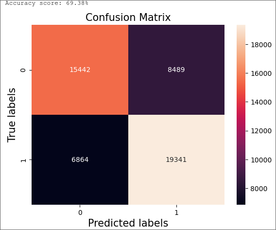
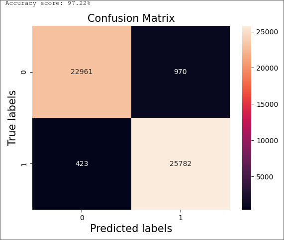

This project was made for Aalto University course CS-C3240 Machine Learning D 

## Classifying Sound Clips as Human-Produced or Computer-Generated Using Logistic Regression and K-Nearest Neighbors
# 1.    Introduction

## 1.1 Background
Speech synthesis is a process where speech is artificially generated by a speech synhesizer. In this report we discuss speech synthesis applied to create vocals  for songs. Voice synthesizer software is currently at a stage where it is possible to create very human sounding vocals. This means that it is not always possible for a human to tell apart synthesized voice from a genuine human voice.  Our aim in this report is to create a machine learning model that is able to distinguish between a synthesized and a human singing voice by using supervised learning. To this end we compare logistic regression and k-nearest neigbours. 
## 1.2. Structure
Section 2 of this report formulates the problem as a machine learning problem and introduces the dataset used to train the model. Section 3 explain the methods used to analyze the dataset and the choises made  in this process. Section 4 discusses the results obtained in this report. Section 5 concludes the report and discusses the findings and evaluates the success of this report.

# 2.    Problem formulation

## 2.1. Problem
A voice contains some amount of sound energy that is expended by a sound source. The rate at which this is done per unit time is called sound power. The power of a sound distributed over frequency is called the power spectrum of sound.

One way to represent features of a sound is a method called mel-frequency-cepstrum (MFC). The mel scale is a scale of pitches that humans perceive to be an equal distance from each other. The more the frequency increases the higher increases in it are needed for the perceived pitch to increase another increment. MFC represents the short-term power spectrum of a transformed sound on a mel scale. 

The MFC is made up of coefficients (MFCC) that represent the power of a sound over an interval on the mel scale. Taking the value of these coefficients over a short period of time and using them as features allows us to teach a model the characteristics of a voice.

Voices can be differenciated from each other using a representation of their power spectrum called Mel-frequency cepstral coefficients(MFCC). A frequency representation of a song can be transformed into Mel-frequency cepstral coefficients using Fourier transform and mapping it into the mel scale and taking the discrete cosine transforms of logs of those frequencies. The result is a spectrum whose amplitudes are the Mel-frequency cepstral coefficients. Using these as features of a model alongside a binary indicator variable that tells whether the song is synthesized or sung by a human.

# 3.    Methods

## 3.1. Dataset explained
The dataset consists of 16 songs that feature synthesized vocals and 15 songs that are sung by humans.  The dataset is collected from Youtube using the Pytube[1] library. After download the songs are processed into vocals and the accompanying instruments. Only the vocals are used for this task. The vocals are split into 6-second long clips from which their MFCC wil be obtained. After the processing each of the clips produces 259 datapoints that have 32 features. The final length of the dataset is thus 460 x 259 + 360 x 259 = 212380 datapoints.

### 3.1.1.   Features and Labels
According to the literature[2]  32 MFCC:s are optimal for voice recognition. This has been mostly found out with trial and error. These simply labeled as 1-32.  Features 1 -32 are number values representing the amplitudes of the transformed dataset.

There is also a binary indicator label that is whether the song has artificial (0) or real (1) vocals.
### 3.1.2. Model validation
The data was split randomly into training and test sets. The size of the training set is 80% of the samples and the size of the validation set is 20%.  The split ratio is based on a ratio recommended during the course.

## 3.2.    Machine learning model and loss function

### 3.2.1. Method 1 - Logistic regression
The hypothesis space for this problem lies between 0 and 1, it is the probability that the given song is sung by a real human singer. The method used for this report is logistic regression. It is especially suitable for datasets with binary classification problems.

The loss function for training of model is logistic loss as it is not as sensitive to outliers. To evaluate the performance of the model, 0/1 loss is used as it can be applied to binary classification problems quite well.

### 3.2.2. Method 2 - K-Nearest Neighbors
The hypothesis space for k-nearest neigbors is between 0 and 1. K-nearest neigbours classifies the input based on which class has more neigbours to the input. The method can be used for classification problems such as the one at hand. 

During training there is no loss function. This is due to the fact that the training part is only keeping the training data in memory and then running the nearest neighbour algorithm for the new input. The loss function of the result is 0/1 loss as the model either correctly or incorrectly classifies the input.

# 4.    Results

## 4.1. Logistic Regression

Confusion matrix of the logistic regression model: true negatives in top left, false positives in top right, false negatives in bottom left and true positives in bottom right

The accuracy score for logistic regression was 69,38%. This is calculated with sk-learn accuracy_score. The data which it was tested on is separate from the data it was trained on. The training data was randomly selected from the entire dataset. The validation error is quite high, over 30%. The classification threshold of the method used for this task (sklearn logistic regression) uses 0.5 as its threshold for choosing the label. This is already quite low which makes the result of this method even less impressive.

## 4.2. K-Nearest Neighbours

Confusion matrix of the knn-model: true negatives in top left, false positives in top right, false negatives in bottom left and true positives in bottom right

The accuracy of the knn-model was 97,22% on the same test data. The high accuracy suggest some overfitting that the knn-model is prone to. 
## 4.3 Choice
The final choice of model is the the knn-model. I have chosen the possibility of overfitting over the logistic regression as its prediction accuracy was low.

# 5.    Conclusion
The aim of this report was to classify audio clips into human-produced or computer-generated. The outcome for this dataset is somewhat satisfactory. More development is needed to ensure that the accuracy holds in real-life scenarios. 

The accuracy of the logistic regression model was quite low, about 70%. Another method could be considered instead of logistic regression. To improve logistic regression we need to look to the data. More data might make the classification more accurate. Tweaking the amount of coefficients might also be beneficial. 

The accuracy of the knn model seems to be quite good. However the chance of overfitting needs to be addressed to improve it. As some of the training data might be from the same songs that have similar qualities, one way to improve the model would be to get more training data.

# 6. References
[1] https://pytube.io/en/latest/index.html
	First 15 songs of these playlists:
	- https://www.youtube.com/playlist?list=PLB02wINShjkBKnLfufaEPnCupGO-SK6e4
	- https://www.youtube.com/playlist?list=PLenUt8-yT90h031pCIMKJLw49uZ_2b62L
[2]Lin. Kin Wah Edward (2018),  [Singing Voice Analysis in Popular Music
using Machine Learning Approaches]( https://www.researchgate.net/profile/Kin-Wah-Edward-Lin/publication/330411287_Singing_Voice_Analysis_in_Popular_Music_using_Machine_Learning_Approaches/links/5c3ee021458515a4c7296749/Singing-Voice-Analysis-in-Popular-Music-using-Machine-Learning-Approaches.pdf) , Singapore University of Technology and Design
	chapter 4.1
